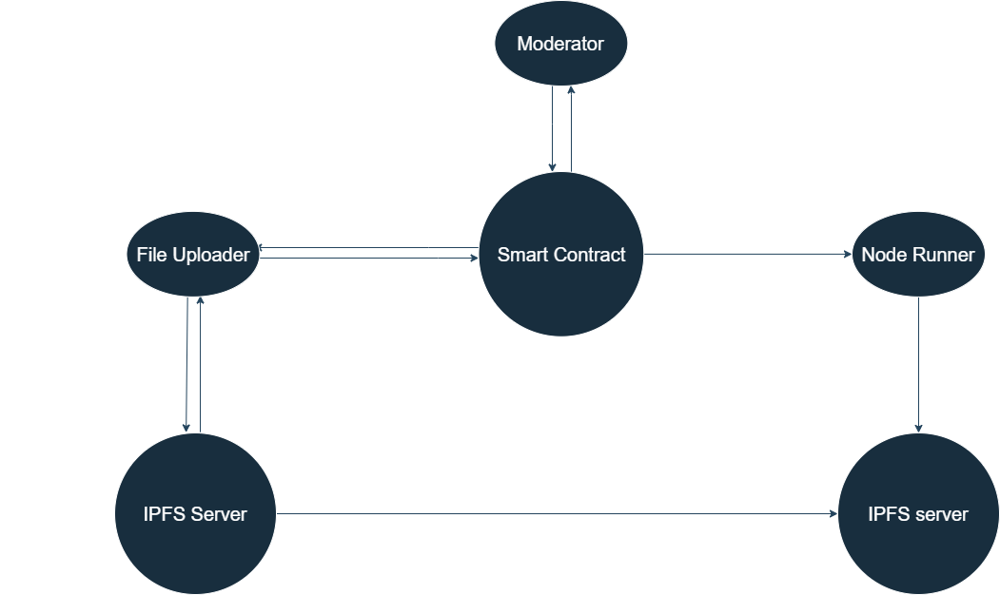

# 🎉 MassaFiles - Decentralized Storage Solution 🎉

This project is a decentralized storage solution that enables users to store and manage files using IPFS through the Massa blockchain.

The main goal of this project is to provide a user-friendly interface for storing files off-chain using IPFS on Massa blockchain nodes, taking advantage of their available disk space.

⚠️ Prerequisites:

- An IPFS server running on your machine is required to use this DApp

## 🔄 System Architecture



👥 User Roles:

1. **Content Uploader**

   - Can upload collections containing files
   - Collections are added and pinned to their local IPFS server
   - Can only view collections approved by moderators
   - Collection CIDs are registered in the smart contract with metadata (upload date, owner, name, moderation status)

2. **Moderator**

   - Designated by the smart contract owner
   - Access to moderation controls on collections page
   - Can approve or reject collections
   - Can view all collections (approved, pending, rejected)
   - Only owner can assign moderators through a dedicated page

3. **Node Runner**
   - Can view all approved collections from the smart contract (unless also a moderator)
   - Can see local pinning status of collections
   - Can pin approved collections to their IPFS server

📂 Collection Features:

- View collection contents in a dedicated page
- Preview, open in new tab, or download individual files
- Download entire collection as ZIP
- Pinning status indicators for all users

🔑 Key Features:

- File Upload: Upload and store files on IPFS
- Collection Management: Create and manage collections of files by registering their cid and metadata to the blockchain
- Moderation System: Approve or reject collections (for moderators)
- IPFS Integration: Pin/unpin files and collections
- User-friendly Interface: Modern SvelteKit-based UI

## ⚙️ Installation Guide

From the root of the project, run:

```shell
pnpm install
```

## 🚀 Running the Application

To start the application:

```shell
turbo start
```

This will:

1. Clean any previous builds
2. Install dependencies
3. Start the application using Turbo

## 📁 Project Structure

- `sveltekit/` - Frontend application built with SvelteKit

  - `src/lib/components/` - Reusable UI components
  - `src/lib/ts/` - TypeScript utilities and types
  - `src/lib/runes/` - Svelte stores and state management

- `wasm/` - Smart Contract code written in AssemblyScript
  - `assembly/` - Main contract code
    - `contracts/` - Smart contract implementation
      - `cids.ts` - Collection CIDs management
      - `ipfs.ts` - IPFS integration
      - `map.ts` - Storage mapping functions
      - `mods.ts` - Moderator management
    - `__tests__/` - Contract test files

## 🛠️ Technologies Used

- Frontend: SvelteKit, TypeScript
- Storage: IPFS (via Kubo)
- Blockchain: Massa Network
- Package Manager: pnpm
- Build Tool: Turbo

## 📝 License

MIT - see LICENSE file for details

## 👥 Contributors

Created by [Kredeum](http://labs.kredeum.com/)
