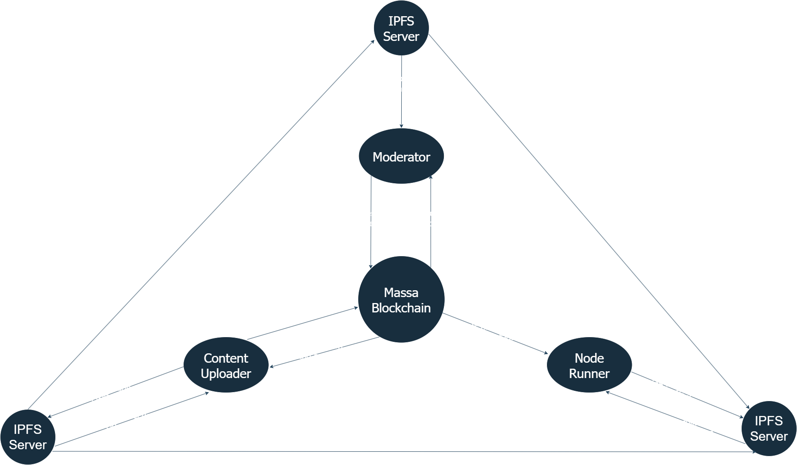

# 🚀 MassaFiles

## 🌟 Why?

To bring a  new decentralized feature to the Massa ecosystem: scalable, community-driven storage.

## 🎯 What?

- **Decentralized Storage for Large Files**: A system designed for big data — decentralized, but not eternal.
- **Complementary to DeWeb**: Works alongside DeWeb (eternal and decentralized) to handle larger content types —
- **Ideal for videos, datasets, and archives** that go beyond DeWeb’s file size scope.

## 🛠 How?

- **Leverage Unused Disk Space**: Tap into underutilized storage across Massa Nodes.
- **Use IPFS for Data Archival**: Collections of files are grouped and referenced by a single IPFS CID.
- **Anchor Metadata on Massa Blockchain**: CIDs are stored and retrieved securely using Massa smart contracts.

## 🔄 Workflow

1. Content Provider uploads a file collection to a Massa Node.
2. Moderator reviews and approves the content.
3. Node Runners opt in to host moderated collections on their local storage.

# 🏗️ System Architecture




## 🚀 Running the Application

## Prerequisites:

- An IPFS server running is required to take full advantage of this DApp
- IPFS configuration has to be done to allow the application to connect to your IPFS server, typcally  like this
```
ipfs config --json API.HTTPHeaders.Access-Control-Allow-Methods '["GET", "POST"]'
ipfs config --json API.HTTPHeaders.Access-Control-Allow-Origin '["https://defiles.deweb.half-red.net", "http://localhost:5173/"]'
```

You have 2 options to run MassaFiles  application, running it locally or on DeWeb

You can enter the URL of your remote IPFS server in the configuration bar if not using default local value `http://127.0.0.1:5001`

### DeWeb

Just go to https://defiles.deweb.half-red.Network

### Locally

From the root of the project, run `pnpm install`

Then from the `sveltekit` directory run `pnpm dev`

The app will run on `http://localhost:5173`

👥 User Roles:

1. **Content Provider**

   - Can upload collections containing files
   - Collections are added and pinned to their local IPFS server
   - Can only view collections approved by moderators
   - Collection CIDs are registered in the smart contract with metadata (upload date, owner, name, moderation status)

2. **Moderator**

   - Designated by the smart contract owner
   - Access to moderation controls on collections page
   - Can approve or reject collections
   - Can view all collections (approved, pending, rejected)
   - Only owner can assign moderators through a dedicated page

3. **Node Runner**
   - Can view all approved collections from the smart contract (unless also a moderator)
   - Can see local pinning status of collections
   - Can pin approved collections to their IPFS server

📂 Collection Features:

- View collection contents in a dedicated page
- Preview, open in new tab, or download individual files
- Download entire collection as ZIP
- Pinning status indicators for all users

🔑 Key Features:

- File Upload: Upload and store files on IPFS
- Collection Management: Create and manage collections of files by registering their cid and metadata to the blockchain
- Moderation System: Approve or reject collections (for moderators)
- IPFS Integration: Pin/unpin files and collections
- User-friendly Interface: Modern SvelteKit-based UI


## 📁 Project Structure

- `sveltekit/` - Frontend application built with SvelteKit

  - `src/lib/components/` - Reusable UI components
  - `src/lib/ts/` - TypeScript utilities and types
  - `src/lib/runes/` - Svelte stores and state management

- `wasm/` - Smart Contract code written in AssemblyScript
  - `assembly/` - Main contract code
    - `contracts/` - Smart contract implementation
      - `cids.ts` - Collection CIDs management
      - `ipfs.ts` - IPFS integration
      - `map.ts` - Storage mapping functions
      - `mods.ts` - Moderator management
    - `__tests__/` - Contract test files

## 🛠️ Technologies Used

- Frontend: SvelteKit, TypeScript
- Storage: IPFS (via Kubo)
- Blockchain: Massa Network
- Package Manager: pnpm
- Build Tool: Turbo

## 📝 License

MIT - see LICENSE file for details

## 👥 Contributors

Created by [Kredeum](http://labs.kredeum.com/)
